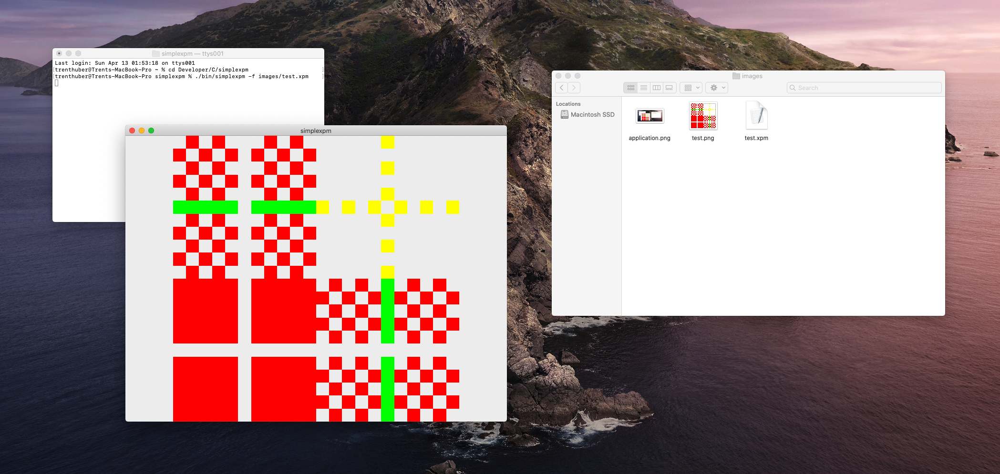

# xpmview

xpmview is a simple GUI application used to view XPM image files.

## Building

> [!NOTE]
> If building on Linux, [Raylib](https://github.com/raysan5/raylib/) has been configured to use X11. If you don't have X11 installed, you can either install the necessary X11 packages or change the `CFGRAPHICS` [macro](https://github.com/raysan5/raylib/blob/282d6478baa51a509bf0a4b1d761a0bd7fd8bbf7/src/rglfw.c#L32) in `external/build.c` to use Wayland instead.

This repository uses submodules, so you'll need to clone it recursively.

```console
> git clone --recursive https://github.com/trenthuber/xpmview/
> cd xpmview/
```

xpmview uses [cbs](https://github.com/trenthuber/cbs/) as its build system. cbs uses C source code as its build files, so the only thing you need to build this project is a C compiler. The first step is to bootstrap the build system by compiling the build file located at the root level of the repository.

```console
> cc -o build build.c
```

Running the `build` executable we just generated will build the entire project.

```console
> build
```

Once built, the application will be located in the `bin/` folder.

```console
> bin/xpmview
```

To clean the repository after building, just run the `clean` executable generated by the build system.

```console
> clean
```

The `clean` executable doesn't remove the root `build` executable, so you can always rebuild the project without having to bootstrap again.

## Usage

Files can either be provided at the command line with the `-f` flag or dragged into the application once it's opened. Once content is loaded, the window can be resized and the content will scale accordingly.

XPM files can be exported to PNG by pressing `s` (PNG images are exported to the same directory the XPM file is in).

If modifications are made to the XPM file while loaded, hitting `r` reloads the content with the new modifications in place.

Finally, with an XPM file loaded, color modes can be changed by pressing corresponding keys (see a complete list of key bindings by using the `-h` flag).

```console
> bin/xpmview -f assets/test.xpm
```


## Theory of Operation

Since valid XPM files are necessarily valid C source code, the most straightforward way to process the data is to just compile the file and access the pixel data directly. Integrating that into an interactive application however involves the use of dynamic libraries loading that data at runtime.

The first phase of the application is to get the path name of the XPM file from the user. Once that's done, we copy the file to a temporary file, compile and link that file to a dynamic library, and then open and load the symbols from that dynamic library-all while the application is running. These symbols have all the data we need to display the image without having to parse almost any of the file itself (we do a bit of parsing to know what symbol name to call, but that's about it). Of course, we still have to parse the actual data stored in the string array, but that's very straightforward since the core standard is relatively simple (I used chapter 2 of [this manual](https://www.xfree86.org/4.8.0/xpm.pdf) as reference). Once the pixel data is parsed, a Raylib texture is generated from it and displayed in the window.
